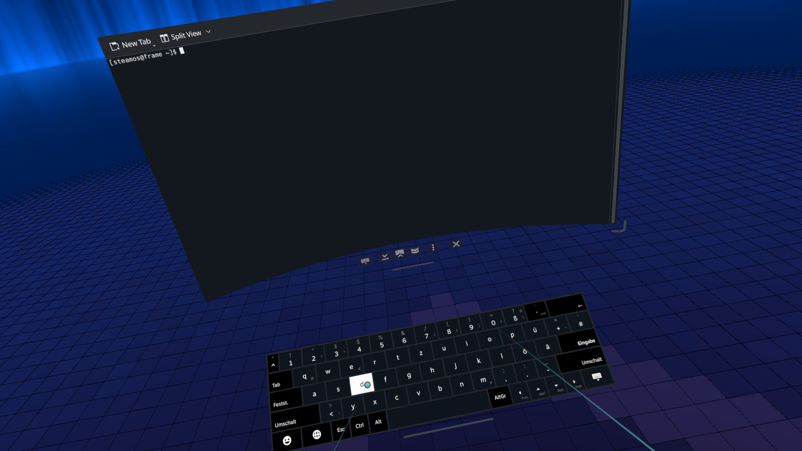
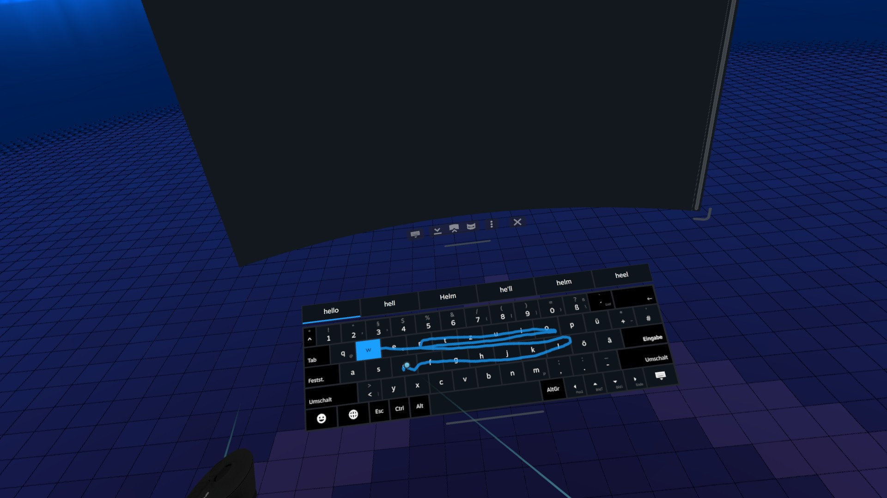

# VR keyboard

Three patches of Steam's VR keyboard: [extra keys](#extra-keys),
[swipe and suggestions](#swipe-and-suggestions) and
[touch typing](#touch-typing). They work together or alone. Options: [README, Options](../README.md#options) (`keyboard.vr.*`).
The keyboard layout of the Steam session itself is a separate fix
([keyboard layout](session.md#keyboard-layout)).

## Extra keys

`keyboard.vr.extraKeys.enable`, module `vr-keyboard-extra-keys` (sources in
`modules/vr-keyboard-extra-keys/`).



**Problem:** Steam's VR keyboard has no Ctrl, Alt or Esc, can't press real
keys, and its text emulation only maps plain ASCII: non-ASCII and
AltGr/dead-key characters on the German keymap (`| @ { [ ] } \ ~ ^`,
backtick, `ä ö ü €`) come out as `1`.

**What you get:**

- Bottom row: `Esc Ctrl Alt [Space] AltGr ← ↑ ↓ → Close`, stable with Shift
  or AltGr. Esc, Ctrl and Alt have Steam's dark special-key face, like its
  AltGr and layout keys.
- AltGr + arrows: Home, End, Page Up, Page Down (hinted on the keys);
  Shift + arrows select text.
- Shift + Tab moves the focus backwards (stock Steam drops the Shift);
  Ctrl + Shift + Tab works too (e.g. previous Firefox tab). A locked Shift
  is released after it, like a tapped one. Shift + Enter and
  Shift + Backspace stay plain Enter and Backspace.
- AltGr + the key left of Backspace (`´` on German, `=` on US): Delete,
  labelled like Steam's Delete key in its language (`Entf`; `Del` if that is
  longer), hinted on the key without AltGr; repeats while held. Layouts with
  an AltGr character on that key get none.
- Layouts without AltGr (US, Dvorak, Colemak, Bulgarian, Chinese, Japanese,
  Korean) get an `Fn` key right of the space bar: Steam's AltGr toggle
  (tap: once, tap twice: locked, hold), for Delete and Home/End/Page Up/Down.
- Ctrl/Alt chords and Esc are real key presses in the VR-selected window; a
  toggled Ctrl/Alt is held down while the keyboard is open (e.g.
  Ctrl+scroll).
- Characters Steam would type as `1` are typed correctly; everything else
  goes through Steam as before.
- Enter always types Return (stock Steam may send it to a Steam search box).

Applies right away: no reboot or Steam restart needed, and it is re-applied
after Steam restarts. Turning it off reverts the keyboard.

**Layouts:** the character routing targets the German keymap; on others it
is harmless, and Esc/Ctrl/Alt/arrows work regardless.

**Security:** the helper service that presses the keys only accepts
single-key Ctrl/Alt chords, the extra keys, Shift + Tab, Ctrl/Alt
hold/release and single non-ASCII/AltGr characters; it cannot type ASCII
text or press Enter (`allowlist.mjs`, tested by the flake check
`vr-keyboard-extra-keys`).

**Caveat:** depends on Steam UI internals; after a Steam update that changes
them the keyboard stays stock and the journal says why (see
[after a Steam update](ui-patches.md#after-a-steam-update)). Tested with
Steam client 1790377368 (UI build 11041156).

**Remove when** Steam's VR keyboard gets these keys.

### How it works

- The `steam-keyboard-patch` user service
  (`modules/vr-keyboard-extra-keys/xdotool-helper.mjs`) injects a patch into
  Steam's `SharedJSContext` over DevTools (`127.0.0.1:8080`) and re-injects
  it after Steam restarts; stopping it (or disabling the option)
  runs the unpatch.
- Ctrl/Alt chords, Esc, Shift + arrows and Shift + Tab are sent with
  `xdotool key` on `:0` (focus follows the VR-selected window); a toggled
  Ctrl/Alt is held down with `xdotool`. Shift is never held as a real key
  (Steam types capitals itself); `shift+Tab` is `ISO_Left_Tab` on any
  keymap.
- Problem characters (non-ASCII, AltGr/dead-key characters on the German
  keymap) are typed with `xdotool type`; everything else goes through
  Steam's own text emulation. On other keymaps those characters are still
  typed by xdotool, which is why the routing is harmless there.
- The new keys use Steam's key type Meta (the dark face); the Delete key
  takes Backspace's key type.
- Found by signature (see
  [finders and signatures](ui-patches.md#finders-and-signatures)).

## Swipe and suggestions

`keyboard.vr.*`, module `vr-keyboard`.



**Problem:** Steam's VR keyboard is tap-only: no swipe typing, no
suggestions, and deleting more than a few characters means many Backspace
taps.

**What you get** with `keyboard.vr.enable` (the sub-features `swipe`,
`autocorrect`, `completions`, `backspaceDrag` and `haptics` are on by
default):

- **Swipe:** press the trigger on the first letter, sweep over the others,
  release on the last. The word is typed with a space before it if needed
  (`text.autoSpace`); alternatives show in the strip. `'` and `-` are typed,
  not swiped.
  With both controllers on the keyboard, a swipe follows only the
  controller that pressed; the other one's laser doesn't enter its path,
  and its presses meanwhile are plain taps.
- **Suggestions** never change text by themselves: a finished tapped word
  that isn't in the dictionary gets corrections (itself first;
  `autocorrect`), a word being tapped gets completions (the typed letters
  first; `completions`). A pick replaces exactly what it typed and can be
  switched again.
- **Backspace drag:** drag Backspace left to delete one character per
  `pixelsPerChar`, with a detent (`wordDetentPixels`) at each word border
  and at the start of what the keyboard typed; drag back right to retype.
- **Strip** (`suggestions.position`): a SteamVR dashboard panel below or
  above the keyboard, or inside the keyboard over its number row. Its
  buttons take the keyboard's key style. Below/above uses the
  [SteamVR debugger](steamvr-debugger.md), turned on automatically.
- **Haptics:** light ticks for drag steps and picks, a Snap at word detents.

**Dictionary** (`dictionary.*`): by default the `keyboard.layout` language
(de, fr, es, it, nl, pt, sv) plus English, else English only. Add words
(`extraWords`, `extraWordFiles`), remove some (`excludeWords`) or configure
the languages:

```nix
steamFrame.keyboard.vr = {
  enable = true;
  suggestions.position = "inside";      # no SteamVR panel
  dictionary.extraWords = [ "SteamOS" "Nix" ];
  dictionary.excludeWords = [ "teh" ];
  backspaceDrag.pixelsPerChar = 20;
};
```

**Text memory:** the keyboard can't read the text field, so it remembers
what it typed itself (`text.bufferChars`); anything it can't follow (Enter,
arrows, extraKeys' keys, another field, `text.resetAfterIdleSeconds`) resets
that, and suggestions only replace text the memory proves intact. Works with
and without [extra keys](#extra-keys) (with it, non-ASCII words are typed
via its xdotool helper).

**Caveats:** depends on Steam/SteamVR UI internals; after an update that
changes them the keyboard stays stock (see
[after a Steam update](ui-patches.md#after-a-steam-update)). Accented words
of other languages are in the dictionary but only swipable where the layout
has the letters. With two controllers on the keyboard, SteamVR sometimes
sends no laser movement for a press (seen for the controller that didn't
own the keyboard's cursor just before): that press stays a tap.

**Remove when** Steam's VR keyboard gets swipe typing and suggestions.

### How it works

- A Steam UI patch (`vr-keyboard`, injected by `steam-ui-patches` like the
  other [UI patches](ui-patches.md)); sources in `modules/vr-keyboard/`.
- Swiped words are matched by shape (SHARK2-style template matching)
  against a dictionary built at build time from wordfreq frequency lists
  and Hunspell, both from nixpkgs (per language the `words` most frequent
  wordfreq entries, shifted by `frequencyOffset`, filtered by Hunspell
  except words at or above `keepFrequentAbove`).
- The strip below/above the keyboard is a SteamVR dashboard panel
  (`suggestions-panel/patch.js`, a patch of SteamVR's `systemui` page on
  port 8087), fed by the `vr-keyboard-relay` user service
  (`suggestions-panel/relay.mjs`) between the two pages.
  With `inside` neither the panel nor the relay runs.
- Found by signature (entries `vr-keyboard`, `vr-keyboard-panel`).

**Tests:** `nix flake check` (checks `vr-keyboard`: text model, corrector,
decoder accuracy on German + English,
gesture input from two controllers) and `keyboard.vr.checks` for the
configured dictionary.

**Debugging:** `window.__sfuiSwipeLog` and `__sfuiSwipePaths` in Steam's
SharedJSContext (replay swipes with `scripts/vr-keyboard-replay.mjs`).

## Touch typing

`keyboard.vr.touchTyping.enable`, module `vr-keyboard-touch`.

**Problem:** Steam's VR keyboard can only be typed on with the laser and
the trigger.

**What you get:**

- Touch a key with the controller's tip, the point the laser starts from,
  to press it; both hands, also at once (e.g. Shift held by one hand).
  The key lights up on contact and is typed when the tip comes back out,
  like a laser press: holding Backspace repeats, holding a letter opens its
  accents.
- A press needs the tip to pass through the keyboard's surface from the
  front (`depth`: that far behind it; default `0`). It ends when the tip is
  pulled back 1 cm from its deepest point. The next press needs the tip
  5 mm in front of the surface again, so resting on a key doesn't repeat it.
  Pointing, the tip behind the keyboard, or coming in from the side
  presses nothing.
- The lasers work as before, also while touching.
- A haptic tick on contact (`haptics`), routed by SteamVR like the
  keyboard's other ticks.

**Caveats:** moving the keyboard pauses touches for 0.3 s. The extra keys' Delete repeat and the swipe patch's gestures react
to the laser only. Depends on Steam and SteamVR UI internals (see
[after a Steam update](ui-patches.md#after-a-steam-update)).

**Remove when** Steam's VR keyboard gets touch input.

### How it works

- **Controller bridge** (module `vr-keyboard-controllers`, turned on by
  touch typing; meant for other keyboard features too): a patch of SteamVR's
  `systemui` page (port 8087, [SteamVR debugger](steamvr-debugger.md),
  turned on automatically). It reads the keyboard's pose with SteamVR's own
  scene graph query (`SGQueryService.requestSGTransform` on an empty
  transform of ours inside the keyboard's mount; every 250 ms) and both
  controllers' poses (`VRHTML.GetPose`). The tip is the device pose times
  the render model's `tip` component; the laser mouse uses the same
  `/pose/tip`. For each hand it computes the tip and the laser's hit
  relative to the keyboard, plus the trigger from the render model's
  animated `trigger` component (not yet verified). The
  `vr-keyboard-controllers-relay` user service carries these frames to
  Steam's `SharedJSContext`: up to ~90 Hz (45 Hz and more under load)
  while a hand's tip is within 10 cm of the keyboard or its trigger is
  pulled, else every second; nothing while the keyboard is hidden. The
  laser hit matches SteamVR's laser to a few px.
- **Touch typing** (patch `vr-keyboard-touch`, `SharedJSContext`): per hand
  `tracker.js` turns the tip's path into press and release, then calls the
  keyboard's own `HandleTouchStart` / `HandleTouchEnd` with the key under
  the contact point. No input is synthesized.
- Found by signature (entries `vr-keyboard-touch`,
  `vr-keyboard-controllers`).

**Tests:** `nix flake check` (checks `vr-keyboard-controllers`: tip and
laser relative to the keyboard; `vr-keyboard-touch`: contact, hysteresis,
two hands).

**Debugging:** `window.__sfuiTouchTypeLog` (`SharedJSContext`: presses,
misses), `__sfuiControllers.last` (the last frame), and in `systemui`
`__sfuiCtl.log` and `__sfuiCtl.last`.
